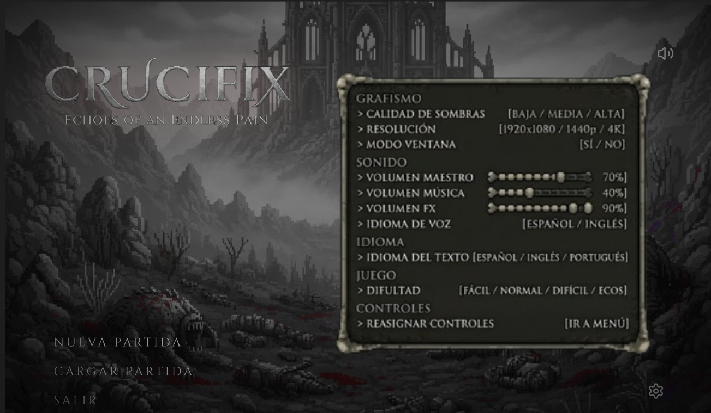
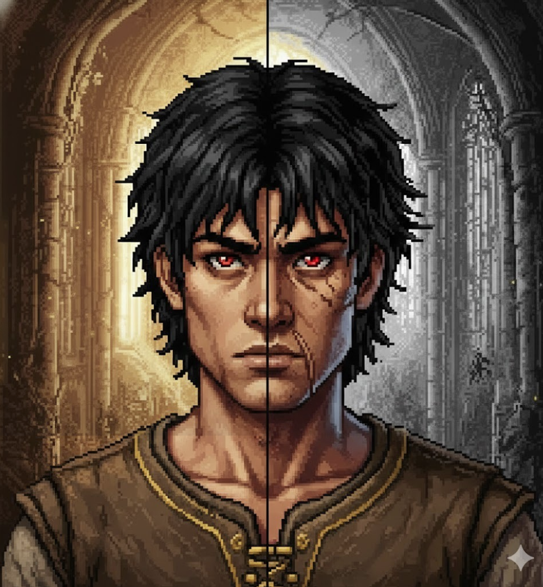
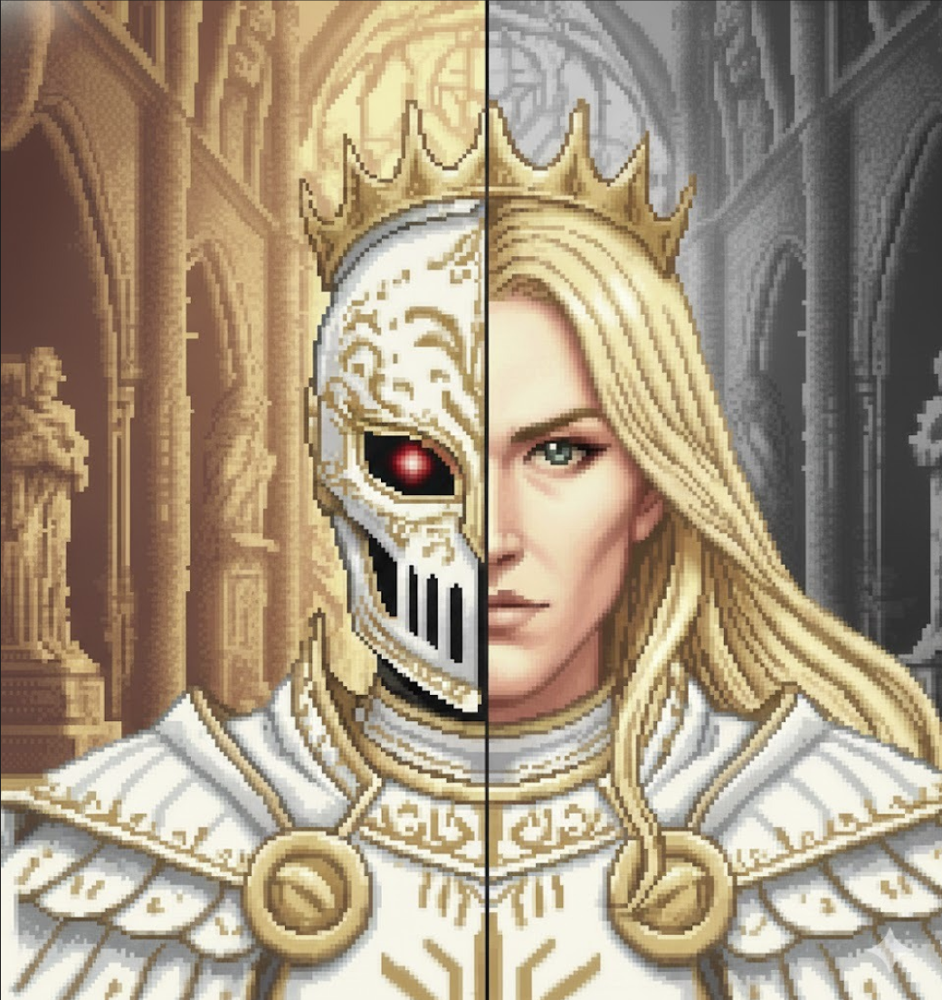
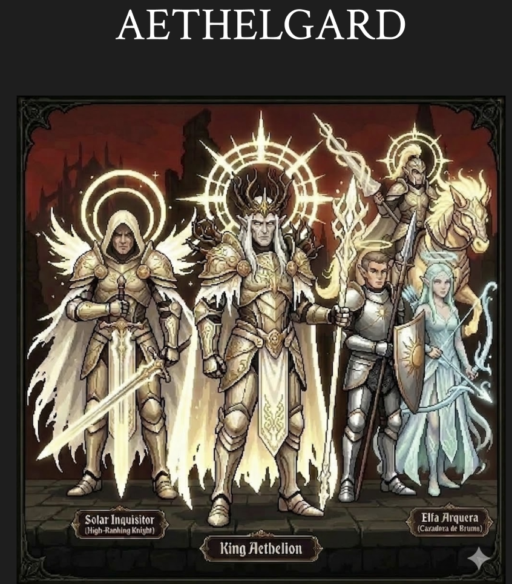
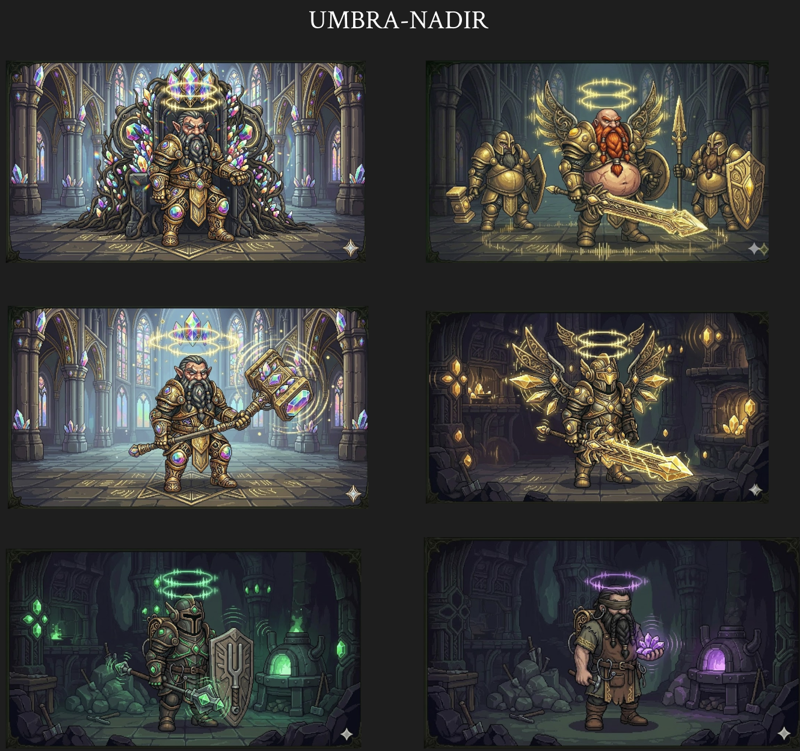
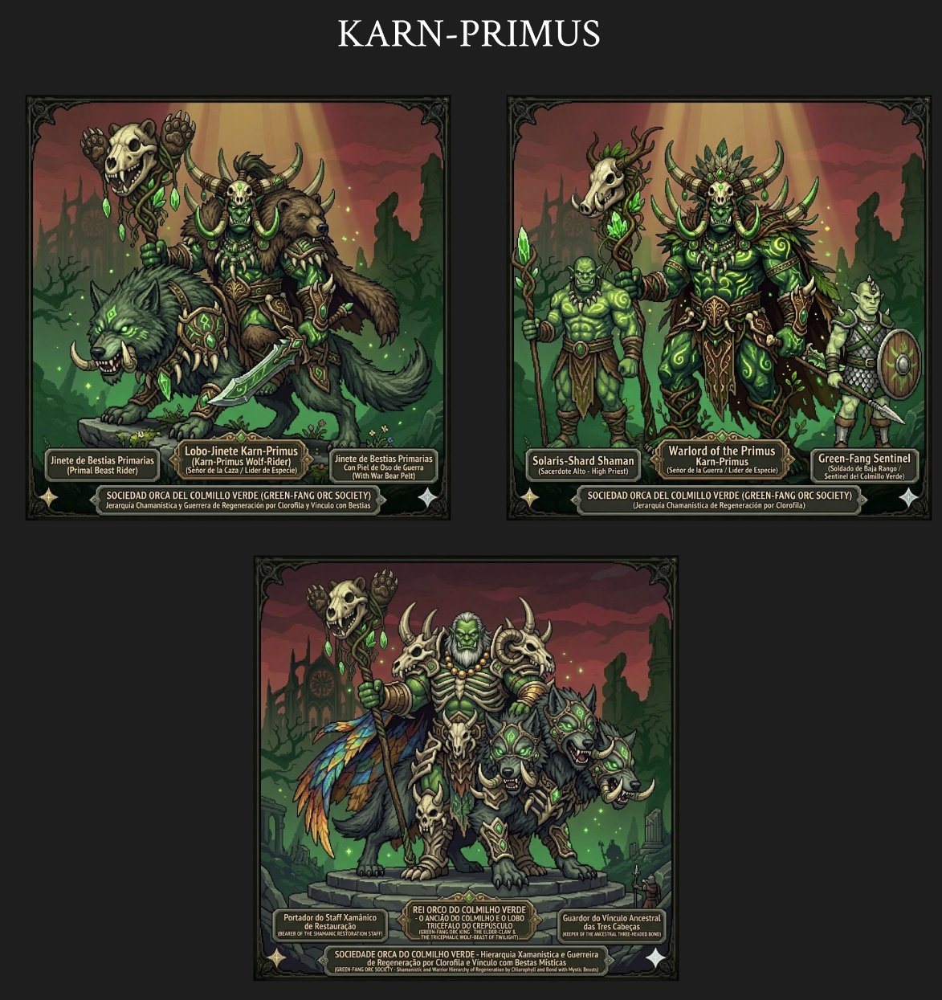
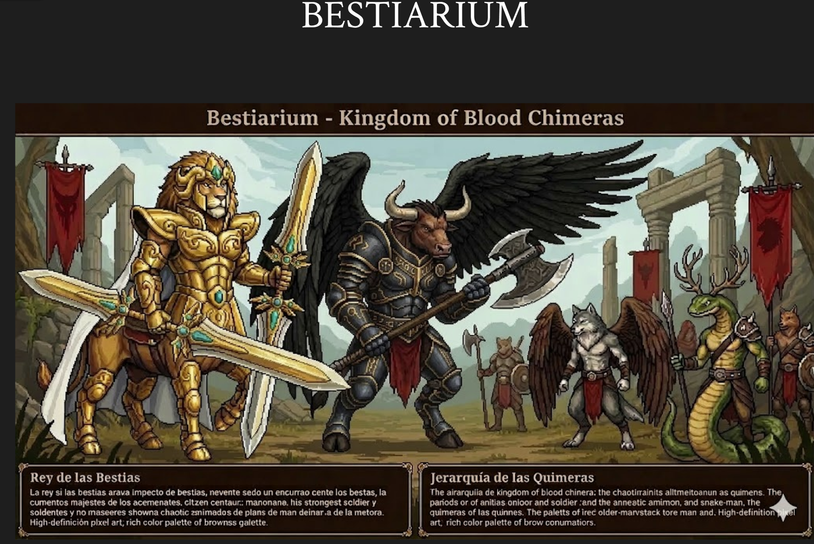
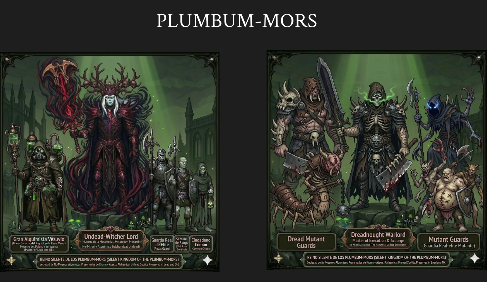

# Videojuego-Crucifix
**Creadores:** Brandon Isaac Miranda Montes, Juraz Gael Miranda Coronado y Erick Bustamante Cruz

En CRUCIFIX, el mercenario Caelum recibe una armadura divina para evitar el retorno del Dios Demonio. Pero tras masacrar los reinos, corromper su alma y asesinar a su hermano Luxiel, descubre la macabra verdad: fue engañado por un parásito. Él mismo es el Dios Demonio y el verdugo de su pasado, condenado a repetir un trágico ciclo eterno.

---

## Galería del Juego y Sistema de Interfaz

| Menú Principal | Menú de Opciones |
| :---: | :---: |
|  |  |

| Caelum (Doble Naturaleza) | Luxiel / El Caballero Mártir |
| :---: | :---: |
|  |  |

| Combate en Tiempo Real | Menú de Pausa | Cacería Fallida (Muerte) |
| :---: | :---: | :---: |
|  |  |  |

---

## Atributos Principales (Stats Base)

| Atributo | Descripción |
| :--- | :--- |
| **Vitalidad (HP)** | Salud física de Caelum. Representada con una barra de mármol que se agrieta y sangra al recibir daño. |
| **Esencia / Energía (MP)** | Recurso requerido para ejecutar las habilidades activas de armas y armaduras. |
| **Tenacidad (Poise)** | Capacidad de recibir impactos sin interrumpir las animaciones de ataque. |
| **Velocidad de Movimiento** | Determina el ritmo al caminar y correr por el mapa. |
| **Agilidad (i-frames)** | Define la distancia del dash y la ventana de invulnerabilidad durante la esquiva. |
| **Poder de Corrupción** | Multiplicador de daño que escala al absorber pecados, reduciendo a cambio la defensa divina. |

---

## Equipamiento: Sets de Armaduras y Armas

### SET LIGERO: "La Agonía Silenciosa" (Velocidad / Crítico)
> *Para el penitente que prefiere el baile de la muerte a la seguridad del escudo.*

*   **Estadísticas del Set:** `+ Velocidad de Movimiento y Ataque` | `+ Probabilidad de Golpe Crítico` | `- Resistencia Física y de Postura`
*   **Mecánica Única (Barra de Adrenalina):** Cada golpe rápido incrementa la velocidad y el daño crítico. Si dejas de atacar o recibes un golpe, la barra cae drásticamente.
*   **Pasivas del Set:**
    *   **Precisión Quirúrgica:** Los ataques por la espalda infligen un +50% de daño.
    *   **Danza de la Muerte:** La esquiva perfecta ralentiza el tiempo para los enemigos durante 1.5s (Witch Time).
    *   **Filo de la Locura:** A menor salud tenga Caelum, mayor será su daño crítico.
    *   **Impulso Etéreo:** Asestar un *Destello del Mártir* reduce el tiempo de recarga de las habilidades de arma.
    *   **Gracia del Vacío:** Concede 2 segundos de invulnerabilidad tras ejecutar a un enemigo.

*   **Habilidad de Armadura (Activa):** *Destello del Mártir*
    *   **Divino (Viacrucis de Marfil):** Dash que empala a los enemigos con lanzas de luz al finalizar la trayectoria.
    *   **Corrupto (Suelo del Sacrilegio):** Dash sombrío que crea un campo circular en el suelo; otorga +25% de daño y robo de vida/energía a Caelum sobre los enemigos malditos.

#### Armas del Set Ligero:
1.  **Estoque con Daga (Penitencia Aguda):**
    *   **Divino (Juicio de la Punta):** Estocada frontal perforante.
    *   **Corrupto (Ancla del Purgatorio):** Clava un gancho para orbitar alrededor del enemigo y apuñalarlo por la espalda.
2.  **Martillo Ligero con Cincel (Escultor de Almas):**
    *   **Divino (Cincel del Destino):** Proyectil rebotador que imbuye el martillo de luz al retornar.
    *   **Corrupto (Torbellino del Pecador):** Lanza cadenas que succionan a los enemigos directo a las cuchillas.

---

### SET MEDIANO: "El Equilibrio del Mártir" (Técnico / Alcance)
> *Para el guerrero que mide cada centímetro y busca la perfección táctica.*

*   **Habilidad de Armadura (Activa):** *Espejo del Destino*
    *   **Divino (Reflejo del Alba):** Invoca un cristal que duplica e imita tu último ataque especial.
    *   **Corrupto (Eco del Parásito):** Genera una sombra autónoma que ataca a los enemigos y drena su salud.

#### Armas del Set Mediano:
1.  **La Lanza (El Susurro del Firmamento):**
    *   **Divino (Ascensión del Justo):** Carga frontal seguida de un pilar de luz ascendente.
    *   **Corrupto (Raíces de la Condena):** Inmoviliza totalmente a los enemigos mediante zarcillos de sombra.
2.  **Espadas Dobles (Las Gemelas del Sacrificio):**
    *   **Divino (Velo de la Pureza):** Giro protector que repele proyectiles.
    *   **Corrupto (Dardos de la Inquina):** Cada corte dispara automáticamente proyectiles sombríos.

---

### SET PESADO: "El Sarcófago del Juicio" (Tanque / Impacto)
> *Para el coloso que se convierte en la última línea de defensa ante el abismo.*

*   **Habilidad de Armadura (Activa):** *Bastión del Penitente*
    *   **Divino (Nova del Resguardo):** Bloqueo masivo que desencadena una onda expansiva de luz.
    *   **Corrupto (Frenesí de la Piedra):** Entra en modo Berserker; regenera vida constantemente pero consume la esencia del alma.

#### Armas del Set Pesado:
1.  **Espada y Escudo (El Credo y el Muro):**
    *   **Divino (Sello de la Cruz):** Marca a los enemigos para infligir doble daño tras un golpe de escudo.
    *   **Corrupto (Fauces del Guardián):** Ejecuta un Parry perfecto donde el escudo "devora" el ataque enemigo y lo convierte en energía.
2.  **Mandoble (La Última Palabra de Dios):**
    *   **Divino (Corte Expiatorio):** Tajo descendente monumental que invoca un colosal pilar de luz.
    *   **Corrupto (Hendidura del Abismo):** Abre una grieta en la realidad que atrae a los enemigos hacia la hoja.

---

## Muestrario de Armas y Armaduras

| Catálogo de Sets y Mandoble | Catálogo de Armas Técnicas y Ligeras |
| :---: | :---: |
|  |  |

*   **Escultor de Almas (Martillo Ligero con Cincel):** *El arte de esculpir la muerte.* El cincel marca puntos de presión en el enemigo que, al ser golpeados por el martillo, provocan explosiones internas de luz o sombras.
*   **Penitencia Aguda (Estoque con Daga):** *Precisión que detiene el tiempo.* En su forma corrupta, la daga se entierra como un parásito drenando vida, mientras el estoque ejecuta cortes invisibles al ojo humano.

---

## Árbol de Habilidades (Pasivas Globales)

Desbloqueadas al avanzar en la historia y recolectar **Reliquias de Pecado**.

### 1. Rama de Esencia (Movilidad y Exploración)
*   **Impulso de Fe / Sombra (Dash Base):**
    *   *Fase Divina:* Impulso veloz de luz pura.
    *   *Fase Corrupta (Acto 2+):* Desplazamiento sombrío que permite atravesar enemigos y barreras de "niebla de pecado".
*   **Salto del Mártir (Doble Salto):** Libera esquirlas de mármol. Al corromperse, las esquirlas cambian a garras de sombra que permiten escalar paredes orgánicas.
*   **Sentido del Cazador:** Revela zonas secretas en el mapa. Inicialmente brilla en dorado; al corromperse, las paredes secretas "sangran".

### 2. Pasivas Globales (Mejoras Directas)
*   **Vigor de la Cicatriz:** Aumenta la salud máxima. *(Efecto visual: Luz en el pecho en estado Divino / La cicatriz facial brilla en rojo en estado Corrupto)*.
*   **Voluntad de Hierro:** Reduce el retroceso (Knockback) sufrido al recibir daño.
*   **Hambre del Génesis:** Atrae orbes de experiencia y salud desde una mayor distancia.
*   **Agudeza del Verdugo:** Amplía el margen de tiempo para efectuar parries y esquivas perfectas.

### 3. Rama de Absorción (Mecánica de Almas)
*   **Cosecha de Pecados:** Aumenta la cantidad de consciencia obtenida por cada baja.
*   **Memoria de la Carne:** Recupera una pequeña porción de salud al absorber el pecado de un enemigo.
*   **Persistencia del Parásito:** Prolonga el tiempo que los enemigos permanecen aturdidos antes de recibir una ejecución.

---

## Reinos, Facciones y Biomas de CRUCIFIX

### 1. AETHELGARD: La Inquisición Solar y el Reino Divino

| Facción y Jerarquía | Visión Arquitectónica del Bioma |
| :---: | :---: |
|  |  |

*   **Lore de la Facción:** Reino de seres lumínicos y elfos bendecidos encabezado por el **King Aethelion**. Su fuerza militar incluye a los *Solar Inquisitors* (caballeros de alto rango), jinetes celestiales y las *Cazadoras de Bruma* (Elfas Arqueras).
*   **Bioma:** Una majestuosa ciudad-catedral de cristal, mármol blanco y acueductos dorados que canalizan energía divina entre montañas heladas.

---

### 2. UMBRA-NADIR: El Reino Enano de los Cristales y la Forja

| Facción y Jerarquía | Visión Arquitectónica del Bioma |
| :---: | :---: |
|  |  |

*   **Lore de la Facción:** Civilización subterránea de guerreros enanos protegidos por halos místicos y armaduras de oro e incrustaciones de cristal. Su jerarquía abarca desde herreros de forja hasta reyes guerreros armados con martillos resonantes.
*   **Bioma:** Un trono y templo ancestral tallado en las profundidades de la caverna, rodeado de ríos de agua subterránea, runas antiguas y gigantescos geodas de cristal de maná.

---

### 3. KARN-PRIMUS: Sociedad Orca del Colmillo Verde

| Facción y Jerarquía | Visión Arquitectónica del Bioma |
| :---: | :---: |
|  |  |

*   **Lore de la Facción:** Jerarquía chamánica y guerrera caracterizada por la regeneración por clorofila y su vínculo con bestias místicas. Liderados por el *Lobo-Jinete Karn-Primus* y el *Rei Orco do Colmilho Verde* junto a su lobo tricéfalo.
*   **Bioma:** Un bastión de piedra orca infestado de raíces de corrupción, altares totémicos y un pilar central de luz verde esmeralda donde se realizan rituales chamánicos.

---

### 4. FERRUM IGNIS: Reino Dragonoide de la Forja Volcánica

| Facción y Jerarquía | Visión Arquitectónica del Bioma |
| :---: | :---: |
|  |  |

*   **Lore de la Facción:** Sociedad de draconianos militarizados que va desde mineros hasta comandantes y el *Rey de la Forja Volcánica*. Dominan la técnica de fundición pira, exhalando fuego directamente sobre el metal.
*   **Bioma:** Una impresionante fortaleza industrial rodeada de ríos de lava, tuberías de obsidiana, engranajes colosales y el "Corazón de Obsidiana" en el centro de la caldera.

---

### 5. BESTIARIUM: El Reino de las Quimeras de Sangre

| Facción y Bestiario | Coliseo y Estructura Circular |
| :---: | :---: |
|  |  |

*   **Lore de la Facción:** Una coalición caótica de bestias y quimeras de combate. Está liderada por el *Rey de las Bestias* (un centauro-león de armadura dorada) e incluye minotauros con alas de azabache, hombres-serpiente y guardianes de la noche.
*   **Estructura del Bioma:** La colosal arena circular de Bestiarium, dividida en múltiples sectores temáticos y laberintos donde las quimeras y bestias de combate ponen a prueba a los penitentes.

---

### 6. PLUMBUM-MORS: El Reino Silente de los No-Muertos Alquímicos

| Facción y Jerarquía | Visión Arquitectónica del Bioma |
| :---: | :---: |
|  |  |

*   **Lore de la Facción:** Una sociedad sombría preservada con plomo y aceites sagrados. Gobernados por el *Undead-Witcher Lord*, el *Gran Alquimista Vesuvio* (maestro del aceite y el plomo) y ejecutores colosales como el *Dreadnought Warlord*.
*   **Bioma:** Una urbe gótica e industrial infestada de chimeneas, calderas, canales con fluidos tóxicos luminiscentes y laboratorios alquímicos en ruinas.

---

### 7. AETHER-VELO: Las Sirenas del Firmamento

| Facción y Jerarquía | Visión Arquitectónica del Bioma |
| :---: | :---: |
|  |  |

*   **Lore de la Facción:** Guerreros marinos y entidades místicas del reino celestial de las aguas. Incluye caballeros tiburón, seres abisales cthulhuides, sirenas guerreras y jinetes de hipocampos celestiales.
*   **Bioma:** Templos de mármol y madreperla suspendidos sobre picos de cristal prismático, donde flotan cascadas irisadas y criaturas marinas estelares.

---

## Arte Conceptual de Personajes, Dualidad y Modo Berserker

| Caelum (El Coloso Penitente) | Casco de la Dualidad (Divino / Corrupto) |
| :---: | :---: |
|  |  |

### Luxiel / El Guerrero Bendito

> *Luxiel, portador de la lanza divina, aclamado por los feligreses antes de la tragedia que desencadenaría el ciclo interminable del Dios Demonio.*

### Caelum: Forma Corrupta y Modo Berserker

> *Consumido por la corrupción etérea y blandiendo el Mandoble manchado con la sangre de sus víctimas, Caelum desata su vertiente más sangrienta e indomable.*

| Caelum: Postura de Combate Corrupto | Caelum: Tajo Aéreo y Ejecución en Masa |
| :---: | :---: |
|  |  |

*   **Postura de Guardia Abisal (Izquierda):** Caelum portando la armadura de hierro oscuro con la corona de espinas, sosteniendo el gran Mandoble embadurnado en sangre antes del combate.
*   **Hendidura del Abismo / Ejecución (Derecha):** Ataque descendente en masa devastando hordas de no-muertos en las catacumbas de la catedral.
